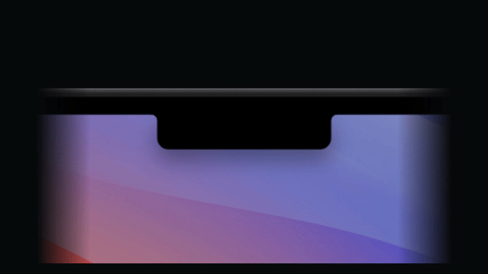
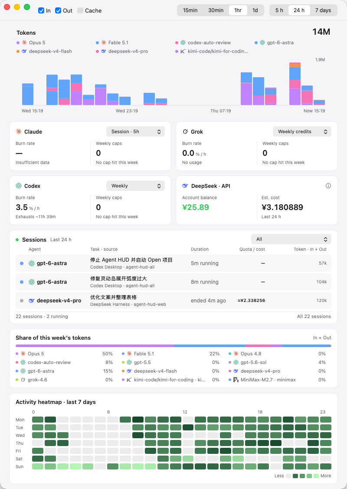

<h1 align="center">Agent HUD Open</h1>

<p align="center">
  <strong>Your agents, at a glance.</strong><br>
  A native macOS utility for agent activity, remaining usage, and local usage statistics.
</p>

<p align="center">
  <a href="https://agenthud.app">Website</a> ·
  <a href="#quick-start">Quick start</a> ·
  <a href="#supported-clients">Supported clients</a> ·
  <a href="#documentation">Documentation</a>
</p>

<p align="center">
  macOS 14+ &nbsp;·&nbsp; Swift 6 &nbsp;·&nbsp; Apache-2.0
</p>

<p align="center">
  
</p>

## At a glance

- **Activity in your notch.** A breathing glow follows agent activity. Expand the panel to see quotas, token usage, and active sessions.
- **Usage in context.** Track reset times, quota trends, model usage, and available API balances in one statistics window.
- **Make it yours.** Choose visible agents, quota thresholds, glow appearance, language, and startup preferences.

Press **⌘⌥H** to toggle the glow. The menu bar gives you quick access to usage and settings.

<p align="center">
  
</p>

## Quick start

**Requirements:** macOS 14 or later, plus Xcode or the Xcode Command Line Tools with a Swift 6 toolchain.

```sh
git clone https://github.com/jazzenchen/agent-hud-open.git
cd agent-hud-open
make check
make test
make run
```

This builds and opens `build/Agent HUD Open.app`. The app is signed ad-hoc for local use; no developer account, signing identity, or provisioning profile is required.

This repository distributes source code and local build tools. Prebuilt applications are not distributed here.

## Supported clients

**Claude Code** · **Codex Desktop / CLI** · **DeepSeek Harness** · **Antigravity** · **Cursor** · **Grok CLI** · **OpenCode** · **Kimi** · **GLM** · **Pi**

Install and sign into the clients you want to monitor. Available activity, quota, and balance information depends on the client and account. See [session lifecycle coverage](docs/session-lifecycle.md) for support for running and terminal turns.

### Data access

No Agent HUD account is required. The app reads local agent activity and queries the corresponding providers for usage or balances where supported, using the installed clients' existing sign-in or configured credentials.

See [data access](docs/data-access.md) for provider details, credential boundaries, and local storage.

## Development

| Command | Purpose |
| --- | --- |
| `make check` | Check source and package boundaries |
| `make test` | Run unit tests |
| `make build` | Build the locally signed macOS app |
| `make demo` | Open settings with sample data |
| `make snapshot` | Render the interface to `build/snapshots` |

Continuous integration checks source boundaries, runs unit tests, builds the application, and verifies its signature and bundled resources. It does not publish binaries.

### Modules

| Product | Responsibility |
| --- | --- |
| `AgentHUDSupport` | Structured JSON, deterministic record identities, and dates |
| `AgentHUDCore` | Agent providers, usage models, local caches, and calculations |
| `AgentHUDDesktop` | Native menu bar, notch, settings, and statistics UI |
| `AgentHUDOpen` | Standalone macOS executable |

The libraries can also be consumed through Swift Package Manager. `DesktopApplication` accepts a `SettingsStore` and `UsageStore`; the host owns any additional services.

## Documentation

- [Architecture](docs/architecture.md) — modules, host integration, and resource ownership.
- [Data access](docs/data-access.md) — provider queries, credentials, and local storage.
- [Session lifecycle](docs/session-lifecycle.md) — evidence for running and terminal turns.
- [Roadmap](docs/roadmap.md) — capability milestones and acceptance criteria.

## License

[Apache-2.0](LICENSE). Included provider references and icon assets retain their [third-party notices](THIRD_PARTY_NOTICES.txt) and [icon license](Sources/AgentHUDDesktop/Resources/LobeIcons-LICENSE.txt).
